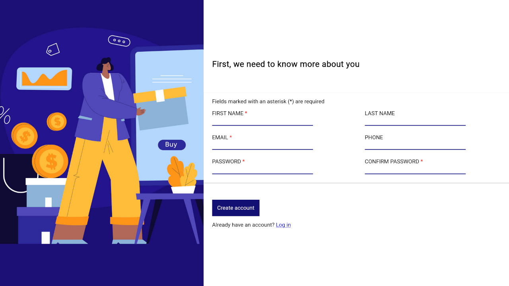

 

  

<h3 align="center">Sign-up Form | The Odin Project</h3>

  

  Yup, it's a sign-up form
     
     
    <a href="https://adrianogtl.github.io/top-sign-up-form/">View demo 👀</a>
    &nbsp;&nbsp;&nbsp;
    <a href="https://www.theodinproject.com/">The Odin Project 📚</a>
  

## 🎯 About

- This project is part of the Intermediate HTML and CSS Course from The Odin Project's Full Stack JavaScript path
- Assignment [here](https://www.theodinproject.com/lessons/node-path-intermediate-html-and-css-sign-up-form#assignment)

## 📝 License

Distributed under the MIT License. See [LICENSE](LICENSE) for more information.

## ♥️ Acknowledgments

- Icon by [Icons8](https://icons8.com)
- Illustration by [Freepik](https://www.freepik.com)

<a href="#readme-top">Back to top ⬆️</a>

